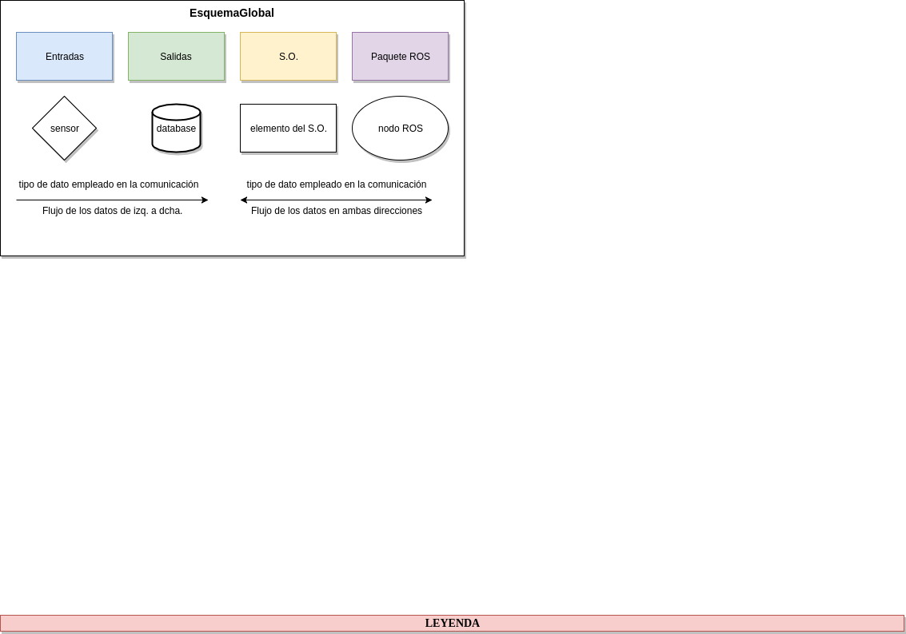
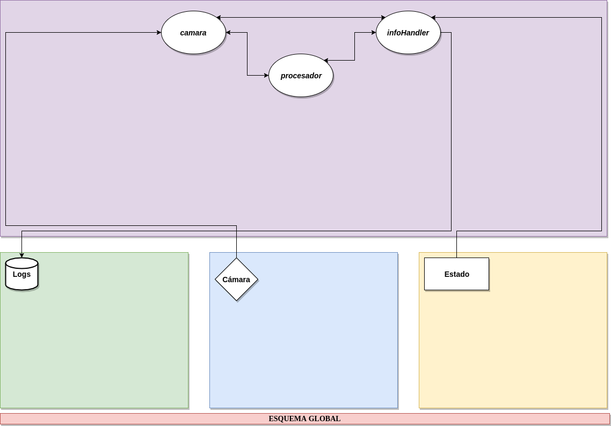

# PESER
- `Versión`: 0.0.0b
  - `Info`: el nodo camara toma la imagen de la carpeta _data/img/_ y la pasa al nodo _procesador_ donde es procesada por _OpenCV_ y _VisionWorks_, el resultado es visualizado y cuando se pulsa un boton se vuelve a repetir todo el ciclo.
  - `Novedades`:
    - Creado un _.launch_ para lanzar todo de forma global.
    
- `Versión`: 0.0.0a
  - `Info`: importa correctamente _OpenCV_ y _VisionWorks_, visualiza la versión instalada de _VisionWorks_ y _OpenVX_ además de cargar y visualizar una imagen con _OpenCV_.

## Esquema del proyecto
  

## Estructura del proyecto
- `data/` donde se encuentran todos los ficheros de datos que utilice el programa.  
  - `img/` donde se encuentran todas las imagenes utilizadas por el programa.
- `doc/` donde se encuentra la documentación relacionada con el proyecto.  
  - `notas.md` apuntes de aclaraciones y cosas utiles durante el desarrollo del proyecto.  
  - `TODO.md` tareas a realizar y realizadas en cada versión del proyecto.
  - `esquemaDelProyecto/` donde se encuentran los esquemas del proyecto de forma gráfica.
    - `esquemaDelProyecto.xml` fichero para _draw.io_ con todos los esquemas.
    - `esquemaGlobal.png` imagen del sistema con cada componente y sus conexiones.
    - `leyenda.png` descripción de cada uno de los elementos que hay en los esquemas.
- `headers/` donde se encuentran los ficheros _.hpp_.
- `sources/` donde se encuentran los ficheros _.cpp_.
- `launch/` donde se encuentran los ficheros _.launch_.
- `scripts/` donde se encuentran todos los scripts que utilice nuestro programa.
- `test/` donde se almacenan las pruebas del programa.
- `msg/` donde se almacennan todos los tipos de mensajes que se usan en el programa.
- `srv/` donde se almacenan todos los tipos de servicios que se usan en el programa.
- `action/` donde se almacenan los tipos de acciones que se usan en el programa.
- `CMakeLists.txt` fichero con las ordenes de compilación para _catkin_.
- `package.xml` fichero con la descripción de nuestro paquete para _ROS_.

## Estructura del código
- `HEADERS:`
  - `camaraAux.h` fichero de cabecera de _camaraAux.cpp_.
  - `procesadorAux.h` fichero de cabecera de _procesadorAux.cpp_.
  - `utilsROS.h` fichero de cabecera de _utilsROS.cpp_.
  - `CONSTANTES.h` constantes globales del programa.
   
- `SOURCES:`
  - `camara.cpp` código del nodo _camara_, encargado de recibir imágenes de la cámara para mandarlas al nodo _procesador_.
    - `camaraAux.cpp` funciones auxiliares que utiliza el nodo _camara_.
  - `procesador.cpp` código del nodo encargado de procesar las imágenes para extraer la información necesaria que permita al robot trabajar.
    - `procesadorAux.cpp` funciones auxiliares que utiliza el nodo _procesador_.
  - `utilsROS.cpp` funciones relacionadas con _ROS_ utilizadas por todos los nodos del programa.
  
## Aclaraciones
- La libreria _VisionWorks_ y _OpenCV_ parecen tener dependencias ciclicas y es necesario duplicar las librerias del proyecto en el _target_link_libraries_ del _CMakeLists.txt_.
- Cuando un _.cpp_ utilice código de otro _.cpp_ hay que incluir el _.h_ y en el _CMakeLists.txt_ añadir en la orden *add_executable* la ruta del _.cpp_ a utilizar.
